<div align="center">


# 🍽️ Masakan Nusantara

<br/>

[]()
[]()
[]()
[]()
[]()

</div>

---

> **🔗 Demo live:** [masakannusantara.my.id](https://masakannusantara.my.id) — scan salah satu contoh QR meja di bagian **Cara Pakai** di bawah untuk langsung coba alurnya dari HP kamu.

### 🔐 Akses Demo

Gunakan kredensial berikut untuk mencoba alur pembayaran dan panel kasir pada lingkungan simulasi:

| Akses | Email / Username | Password / PIN |
|---|---|---|
| 💳 E-Wallet (Simulasi) | — | `987654` |
| 🧾 Akun Kasir | `demokasir@gmail.com` | `Demo123` |

> Kredensial di atas hanya digunakan untuk keperluan demonstrasi. Jangan gunakan pada lingkungan produksi.

---

## Apa itu Masakan Nusantara?

Masakan Nusantara adalah **sistem pemesanan makanan berbasis QR per meja** untuk restoran — gaya self-order ala Gacoan/McD, tapi dibangun dari nol. Pelanggan cukup scan QR yang tertempel di mejanya, lalu pesan dan bayar langsung dari HP — tanpa perlu memanggil pelayan, tanpa antre kasir, dan tanpa perlu bikin akun.

Ini bukan cuma landing page atau prototype — ada dua sisi aplikasi yang jalan penuh: **sisi pelanggan** (scan → pesan → bayar → pantau status → struk) dan **sisi admin/staf** (dashboard, kelola meja & menu, cetak QR otomatis, antrian dapur real-time, laporan penjualan, manajemen akun staf).

---

## Mengapa QR Ordering?

Cara pesan makan konvensional di resto ramai itu ada gesekannya sendiri:

| | Cara Konvensional | Dengan Masakan Nusantara |
|:---:|---|---|
| 🙋 | Harus panggil/tunggu pelayan tiap mau pesan | Scan QR, pesan langsung dari HP sendiri |
| 🧾 | Antre di kasir buat bayar | Bayar langsung dari meja — QRIS atau kasir |
| ✍️ | Request khusus (level pedas, dsb.) gampang salah dengar | Tersimpan persis apa yang diketik pelanggan |
| ⏳ | Nggak tau pesanan sudah diproses atau belum | Status pesanan real-time sampai selesai |
| 🖨️ | Struk kertas gampang hilang/kusut | Struk digital, bisa diunduh/dicetak kapan saja |
| 👨‍🍳 | Dapur baca pesanan dari kertas tulisan tangan | Antrian dapur (KDS) digital, auto-refresh |

---

## ✨ Fitur Utama

### 📱 Scan & Pesan Tanpa Aplikasi, Tanpa Akun
QR unik per meja langsung membuka menu yang sudah ter-scope ke meja itu. Tidak ada instal aplikasi, tidak ada daftar/login — checkout cuma minta nama & email.

### 🌶️ Kustomisasi Pesanan per Item
Tiap menu bisa diatur tingkat pedas (Makanan) atau suhu penyajian (Minuman), plus catatan bebas — dan item yang sama bisa ditambahkan dua kali dengan varian berbeda dalam satu keranjang.

### 💳 Dua Metode Pembayaran
- **QRIS** — simulasi realistis: scan QR asli → buka "Wallet" simulasi → verifikasi PIN, terasa seperti e-wallet sungguhan.
- **Bayar di Kasir** — pelanggan dapat kode 6 digit / QR Order, staf tinggal cari kodenya dan konfirmasi manual dari panel admin.

### 📊 Panel Admin Lengkap
Dashboard ringkasan meja terisi & omzet harian, kelola meja (generate + cetak QR otomatis), kelola menu (foto, harga, stok, opsi pedas/suhu), antrian dapur (KDS) real-time, riwayat & laporan penjualan, serta manajemen staf dengan 2 role (**Admin** akses penuh, **Staf** terbatas ke Pesanan & Kasir).

### 🔒 Dibangun dengan Keamanan Sebagai Prioritas
Session terenkripsi, proteksi CSRF di semua form admin, auto-lock akun 15 menit setelah 5x gagal login, folder `database/` diblokir total dari akses web, dan kredensial database dibaca dari environment variable — bukan hardcoded.

### 🖨️ QR Code 100% Lokal
QR digenerate sendiri lewat `bacon/bacon-qr-code` (murni untuk matematika encoding-nya) dan dirender sebagai SVG tulisan tangan — tanpa panggil API pihak ketiga, tanpa butuh internet saat generate.

---

## 🧭 Cara Pakai

### 1. Scan QR di Meja

Tiap meja punya QR unik yang mengarah langsung ke menu meja itu — tanpa perlu login/daftar akun. Contoh QR meja 1-5 di bawah ini bisa langsung di-scan untuk mencoba alurnya:

<table>
<tr>
<td>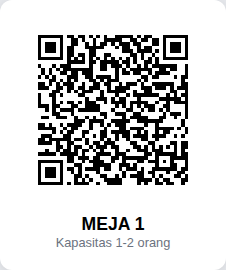<br><sub><b>Meja 1</b></sub></td>
<td>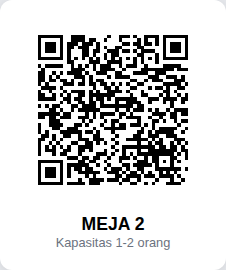<br><sub><b>Meja 2</b></sub></td>
<td>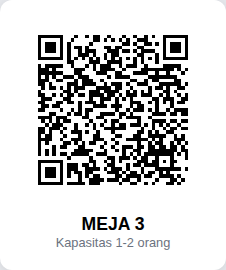<br><sub><b>Meja 3</b></sub></td>
<td>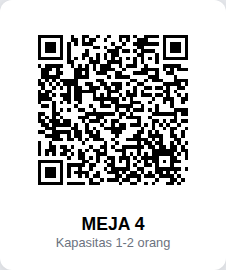<br><sub><b>Meja 4</b></sub></td>
<td><br><sub><b>Meja 5</b></sub></td>
</tr>
</table>

### 2. Pilih Menu & Atur Tingkat Pedas/Suhu

Tap menu untuk buka detail — pilih tingkat pedas (Makanan) atau suhu penyajian (Minuman), tambahkan catatan, lalu masukkan ke keranjang.

<table>
<tr>
<td>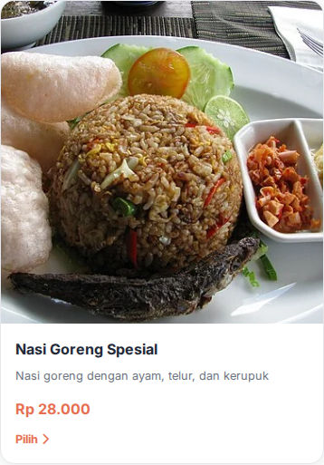</td>
<td>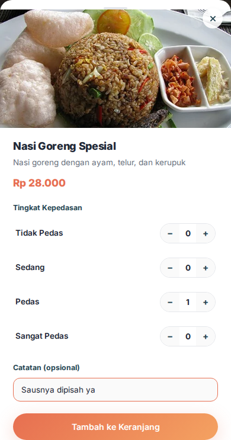</td>
</tr>
</table>

### 3. Checkout — Cukup Nama & Email

Buka keranjang, cek pesanan, lalu isi nama & email di detail pemesanan. Tidak perlu bikin akun.

<table>
<tr>
<td>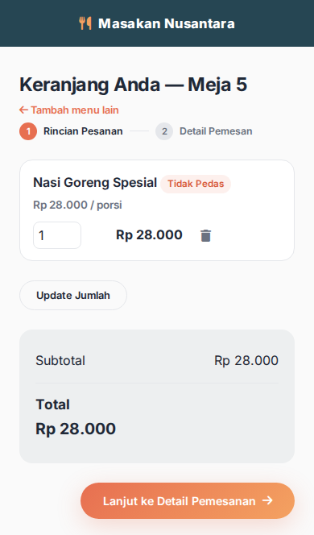</td>
<td>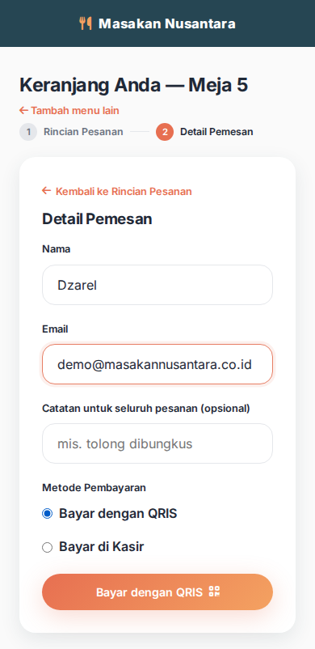</td>
</tr>
</table>

### 4. Bayar — QRIS (Simulasi) atau di Kasir

Pilih **QRIS**: scan kode di layar lalu verifikasi lewat "Wallet" simulasi (PIN), atau pilih **Bayar di Kasir** untuk dapat kode 6 digit yang ditunjukkan/disebutkan ke kasir lalu dikonfirmasi manual di panel admin.

<table>
<tr>
<td>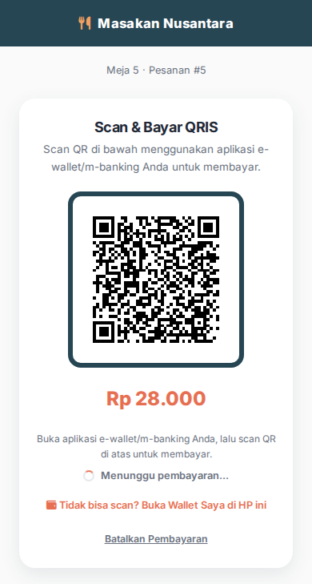<br><sub>Scan & bayar QRIS</sub></td>
<td>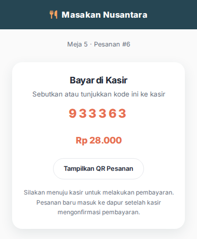<br><sub>Kode kasir di HP pelanggan</sub></td>
<td>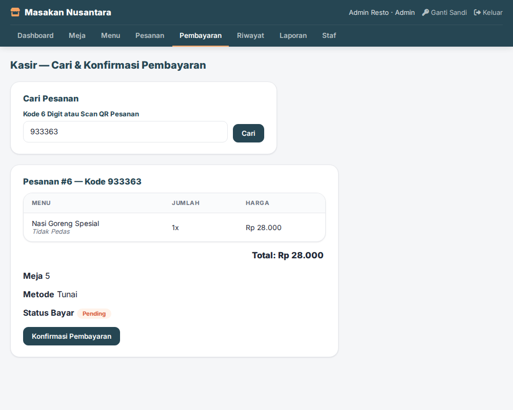<br><sub>Kasir cari kode & konfirmasi</sub></td>
</tr>
</table>

### 5. Pantau Status Real-Time & Unduh Struk

Begitu pembayaran dikonfirmasi, status pesanan ter-update otomatis sampai selesai — struk digital siap diunduh/dicetak.

<table>
<tr>
<td>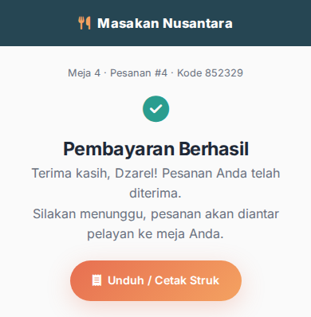</td>
<td>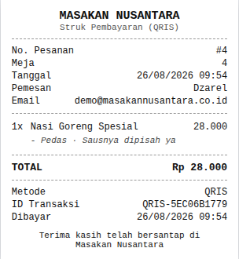</td>
</tr>
</table>

### 6. Panel Admin — Meja, Menu, Antrian Dapur, Laporan

Login di `/admin/login.php` untuk memantau status semua meja secara real-time, kelola meja/menu, antrian dapur (KDS), laporan penjualan, dan akun staf.

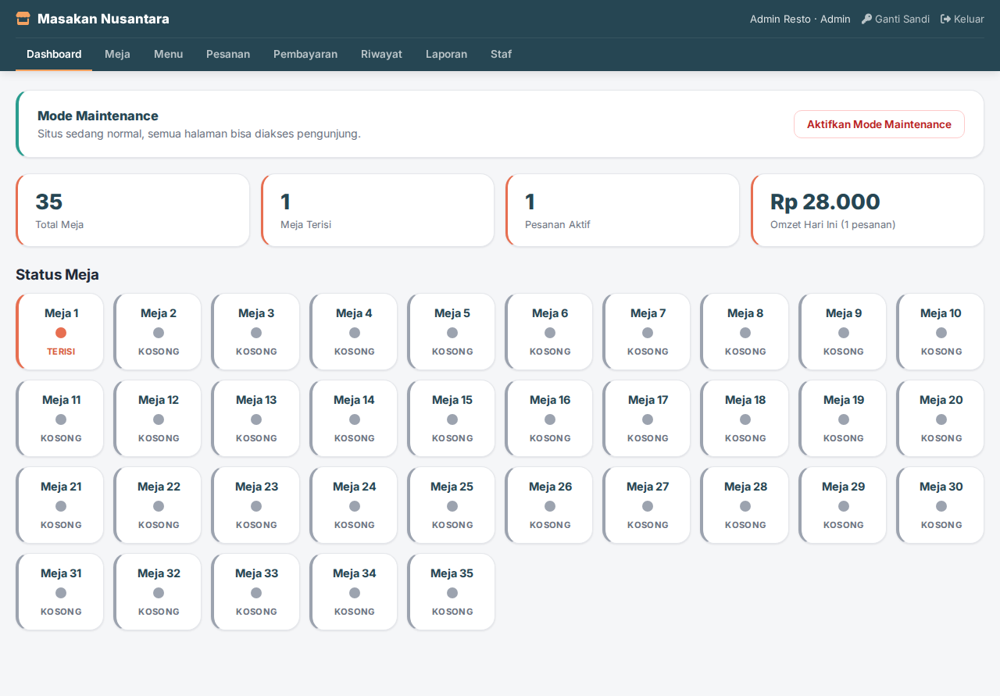

---

## 🔧 Cara Kerja

```
Pelanggan scan QR di meja
       ↓
menu.php resolve meja dari token QR (session-scoped, tanpa login)
       ↓
Pilih menu → atur pedas/suhu → catatan → tambah ke keranjang
       ↓
Checkout: isi nama & email (tanpa akun)
       ↓
Pilih QRIS (simulasi wallet + PIN) atau Bayar di Kasir (kode 6 digit)
       ↓
Pembayaran dikonfirmasi → pesanan masuk antrian dapur (KDS)
       ↓
Status real-time di HP pelanggan sampai selesai → struk digital
```

---

## 🧰 Teknologi

| Layer | Stack |
|---|---|
| Backend | PHP native 8.0+ (tanpa framework) |
| Database | MySQL / MariaDB via PDO |
| Frontend | HTML, CSS, JavaScript vanilla (tanpa build step/bundler) |
| QR Code | [`bacon/bacon-qr-code`](https://github.com/Bacon/BaconQrCode) via Composer — generate SVG lokal, tanpa API eksternal |
| Web server | Apache (`mod_rewrite`, `mod_headers`) |

---

## 🚀 Instalasi

### Prerequisites

- PHP 8.0 atau lebih baru
- MySQL / MariaDB
- Composer

### Langkah-langkah

1. **Clone repository**
```bash
git clone https://github.com/DzarelDeveloper/MasakanNusantara.git
cd MasakanNusantara
```

2. **Install dependency**
```bash
composer install
```

3. **Buat database & import schema**
```bash
mysql -u root -e "CREATE DATABASE masakan_nusantara DEFAULT CHARACTER SET utf8mb4;"
mysql -u root masakan_nusantara < database/schema.sql
```

4. **Isi data awal** (35 meja + menu contoh + akun admin)
```bash
php database/seed.php
```

5. **Buka `admin/login.php`**, login dengan akun default yang dicetak oleh `seed.php`, lalu segera ganti passwordnya lewat menu **Ganti Sandi**.

Kredensial database dibaca lewat environment variable (`DB_HOST`, `DB_PORT`, `DB_NAME`, `DB_USER`, `DB_PASS`) di `includes/db.php`, dengan fallback ke `root` tanpa password untuk kemudahan development lokal.

---

## 🗂️ Struktur Proyek

```
├── admin/               # Panel admin/staf (login-gated)
│   ├── includes/        # auth.php, csrf.php, layout bersama
│   └── *.php            # Dashboard, Meja, Menu, Pesanan, Kasir, Staf, dst.
├── assets/
│   ├── css/              # base, layout, components + per-halaman
│   ├── js/                # main.js + skrip per-fitur
│   └── images/            # foto menu, banner, favicon
├── database/
│   ├── schema.sql         # struktur tabel lengkap (source of truth)
│   ├── migrations/        # riwayat migrasi (referensi historis)
│   ├── seed.php            # data awal (CLI only)
│   └── backfill-order-codes.php
├── includes/               # Helper bersama (db.php, session.php, qr.php, dst.)
├── vendor/                  # Dependency Composer
├── *.php                     # Halaman publik (index, menu, cart, payment, dst.)
├── .htaccess                  # Keamanan: blokir dotfile, mode maintenance, security header
└── README.md                    # File ini
```

---

## 🗺️ Roadmap

### Fase 1 — Fondasi

- [x] Struktur database (meja, menu, order, pembayaran, sesi meja, staf)
- [x] Alur QR scan → menu meja tanpa login
- [x] Keranjang & checkout tanpa akun

### Fase 2 — Alur Transaksi Penuh

- [x] Kustomisasi item (pedas/suhu + catatan) dengan multi-varian di keranjang
- [x] Dua metode pembayaran — QRIS simulasi & Bayar di Kasir
- [x] Status pesanan real-time & struk digital

### Fase 3 — Panel Admin & Hardening

- [x] Dashboard, kelola meja (cetak QR otomatis), kelola menu
- [x] Antrian dapur (KDS) real-time & laporan penjualan
- [x] Manajemen staf 2 role (Admin/Staf) + Mode Maintenance
- [x] Hardening keamanan production (CSRF, session lock, blokir folder `database/`, env credentials)

### Selanjutnya

- [ ] Integrasi QRIS sungguhan via PJP resmi (Midtrans/Xendit/dst.)
- [ ] Notifikasi push/WhatsApp saat pesanan siap

---

## 📌 Catatan Penting

- **Pembayaran QRIS di sistem ini adalah simulasi** — dibuat untuk mendemonstrasikan alur pemesanan end-to-end secara realistis, bukan integrasi payment gateway sungguhan. Metode **Bayar di Kasir** sepenuhnya fungsional/nyata (staf mengonfirmasi manual).
- Proyek ini murni untuk keperluan pembelajaran/tugas sekolah.

---

## 📄 License

Proyek ini dibuat untuk keperluan tugas sekolah. Silakan gunakan sebagai referensi belajar.

---

<div align="center">

Dibuat oleh **Muhamad Dzarel Alghifari** — [@buildwithdzarel](https://instagram.com/buildwithdzarel)

**[🔗 Coba demo live-nya](https://masakannusantara.my.id)**

</div>
